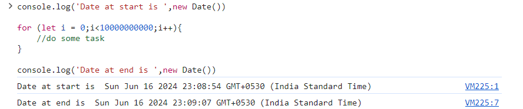

**Asynchronous Programming in JavaScript**

First of all, let's understand what async operations are, in terms of programming.

Asynchronous events or functions are those events which are executed independent of the main program flow. As an example, while scrolling through a social media app, if we like a post, then the network call to update information about the like in the database is async in nature, as it doesn't block the UI of the app. The network call is processed asynchronously independent of the main program flow.

Multi-threaded languages such as C++, Java etc. can handle asynchronous events through multi-threading. As an example, a C++ application can spawn a new thread to handle network call while the main thread continues to operate independently, hence not blocking the UI.

**Let's now talk about JavaScript**

1. JavaScript is a single threaded language.

2. JavaScript is inherently synchronous in nature. However, with the help of the event loop and different queues (like microtask and callback queues) provided by the runtime environment, JavaScript is able to support asynchronous operations. This is discussed below in more detail.

Let's take a look at an example to demonstrate the inherently synchronous nature of JavaScript:

From the example above, we can see that even though the for loop takes a considerable amount of time, it blocks the thread because of synchronous execution of code.

**Let's explore about runtime environment in JavaScript**

[Reference Video Lecture from Namaste JavaScript](https://www.youtube.com/watch?v=2WJL19wDH68)

