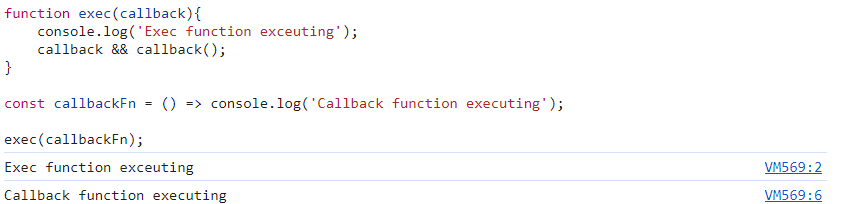
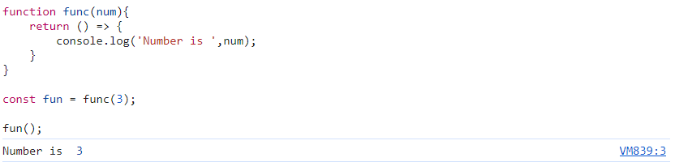
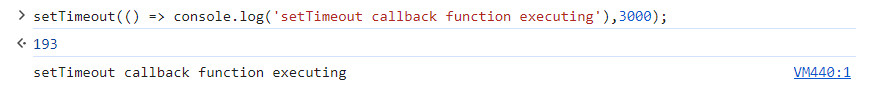
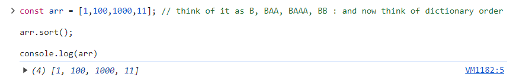
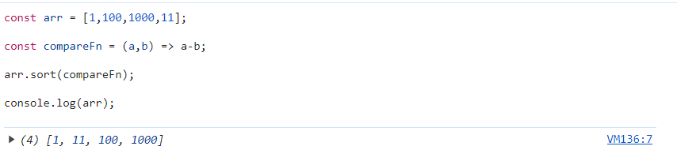
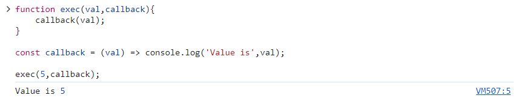
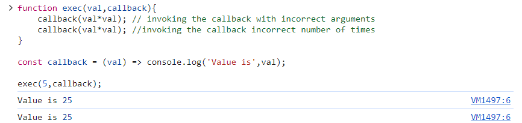
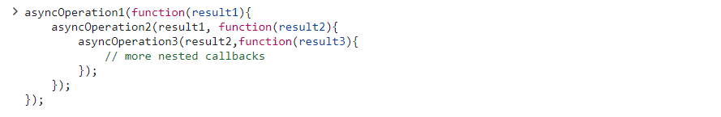

## Let's discuss about callbacks

What are Higher Order Functions (HOFs) in JavaScript? 

A Higher Order Function (HOF) in JavaScript is a function which either takes a function as an argument or returns a function.

Consider the examples below:

In the example above, exec is a higher order function as it takes another function as an argument.

In the example above, func is a higher order function as it returns a function.

Let's take a look at some examples of built-in Higher Order Functions in JavaScript:

setTimeout is a higher order function as it takes a function as an argument.

Let's take a look at Arrays.prototype.sort() function:

The expectation might be that this function would sort the array elements by value. However, the expectation is not correct, the sort() function sorts the values lexicographically. 

We can think of numbers as being mapped to characters and find the dictionary order of words.

0 -> A, 1 -> B, 2 -> C, 3 -> D, 4 ->E , 5 -> F , 6 -> G , 7 -> H, 8 -> I, 9 -> J

We can pass a comparator function to the sort function in order to define custom sorting logic. According to the documentation:

The comparator function should take two arguments: a (the first element for comparison) and b (the second element for comparison). It should return a number where:

1. A negative value indicates that a should come before b.

2. A positive value indicates that a should come after b.

3. Zero or NaN indicates that a and b are considered equal.

To memorize this, remember that (a, b) => a - b sorts numbers in ascending order

In the example above, sort is a higher order function (HOF) which takes another function as an argument.

Let's now discuss about callback functions:

A callback function is a function passed into another function as an argument, which is then invoked inside the outer function to complete some kind of routine or action.

Let's look at some examples:

In the example above, callbackFn is a callback function which is passed to the exec function. Exec function internally invokes the callback function.

**Let's discuss the problems with callbacks**

There are two major problems associated with callbacks, and they are discussed below in the decreasing order of severity:

1. Inversion of Control: In the context of callbacks, this refers to the phenomena of the control being inverted from the programmer to the function consuming the callback. Let's understand with the help of an example:

In the example above, the control is inverted from the programmer to the function consuming the callback i.e. exec function. So, what's the problem here? The problem is that the consuming function might erroneously invoke the callback function with wrong arguments, or may invoke it incorrect number of times.

In the example above, the callback function is being called with incorrect arguments and incorrect number of times, that's the reason inversion of control is problematic.

2. Callback Hell: Callback Hell is a problem associated with callbacks when multiple nested callback functions are used, making the code less readable and maintainable.

Let's understand with an example:

In the example above, multiple nested callbacks are being used which make the code less readable and maintainable.